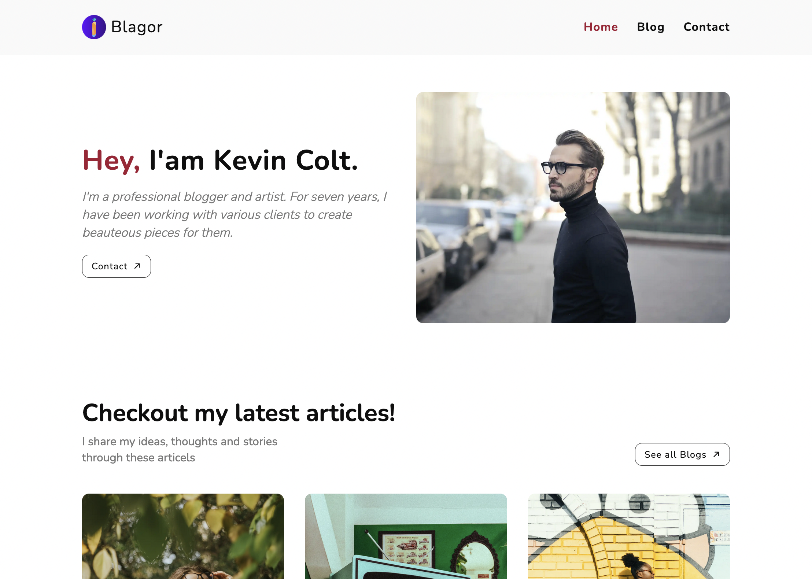

# Blagor By [Inroweb](https://inroweb.com/)

[](https://app.netlify.com/sites/blagor-inroweb/deploys)


An open-source template for jamstack community to build a personal and professional blog, built with GatbyJS and Netlify CMS [LIVE DEMO](https://blagor-inroweb.netlify.app/).


[](https://www.inroweb.com/template/blagor)


## 😃 Features

- Landing, Blog, Contact pages
- Responsive Web Design
- Add / Modify / Delete Content from CMS including Blog posts, Theme colors, Settings, Etc
- Google Analytics
- Social media icons
- SEO Optimized
- Blog Tags
- Netlify Contact Form
- Pagination
- Theme Ui Styling


## Prerequisites for the development environment

For local development, you need
- Node (v16 or higher)
- [Gatsby CLI](https://www.gatsbyjs.org/docs/)
- [Netlify CLI](https://github.com/netlify/cli)

## Setting up the Netlify CMS

Follow the [Netlify CMS Quick Start Guide](https://www.netlifycms.org/docs/quick-start/#authentication) to set up authentication.

## Local Install

```bash
# Clone the repo
git clone https://github.com/Inroweb/Blagor

# Navigate into repo
cd Blagor

# Install the dependencies
yarn install (or) npm install

# Start the development server
yarn start (or) npm start
```

## ❤️ Thank you

We would love to get your feedback and contributions, feel free to [Contect](https://www.inroweb.com/contact)
